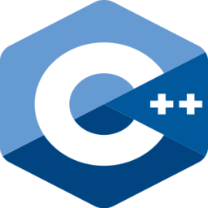
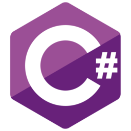
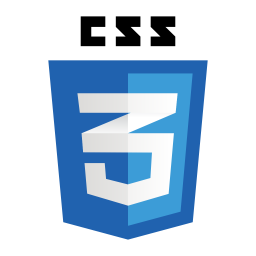
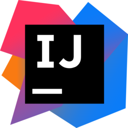

👋 Hello, I'm Wiggle!
💻 My favorite programming language is python/java


<h2> Languages </h2> 







<h2> Tools </h2>


<h2> IDEs </h2>



```java
public class Wiggle {
    public static void main(String[] args) {
        System.out.println("Hello world!");
    }
}
```
